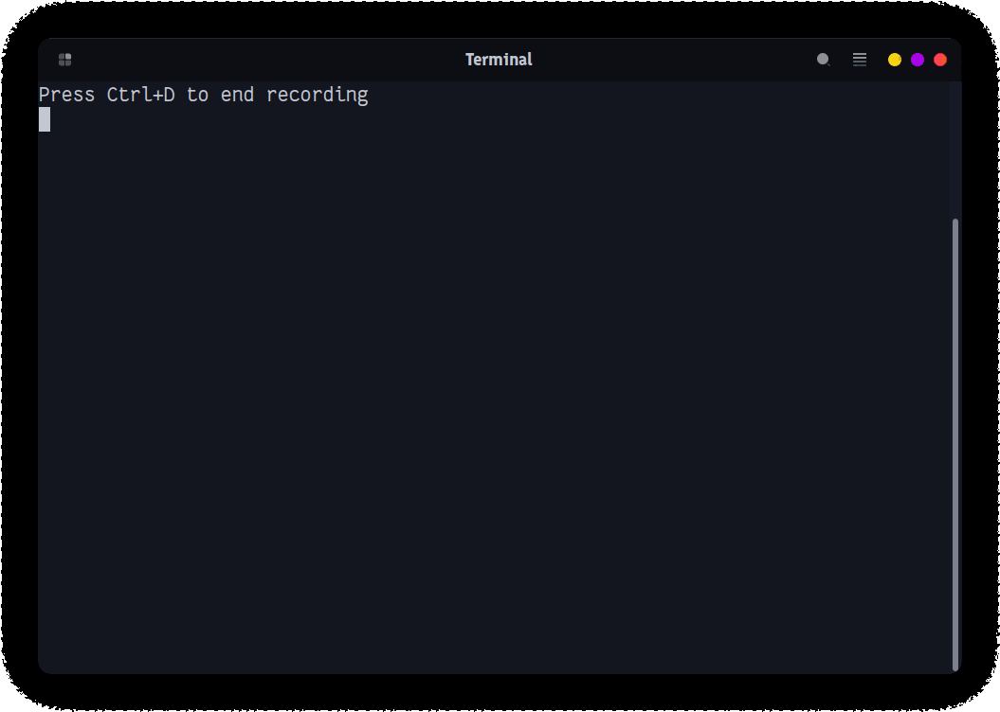
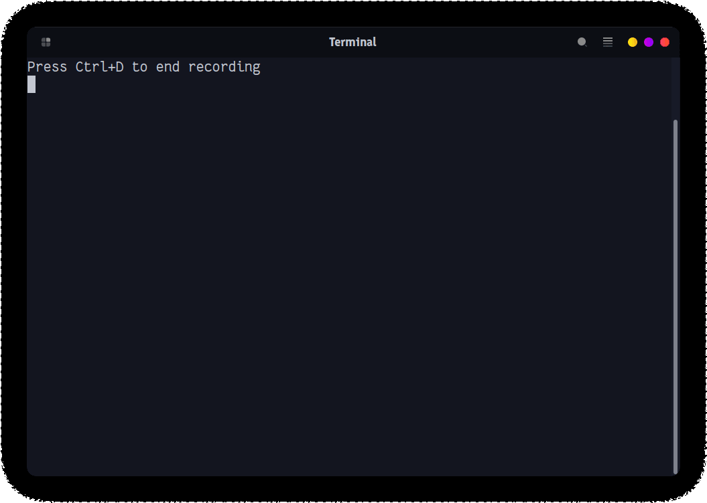

<!-- Improved compatibility of back to top link: See: https://github.com/ujjwalgarg100204/http-server-using-java/pull/73 -->

<a name="readme-top"></a>

<!-- PROJECT SHIELDS -->

[![Forks][forks-shield]][forks-url]
[![Stargazers][stars-shield]][stars-url]
[![LinkedIn][linkedin-shield]][linkedin-url]

<!-- PROJECT LOGO -->
<br />
<div align="center">
  <a href="https://github.com/ujjwalgarg100204/http-server-using-java">
    
  </a>
</div>
  <h3 align="center">HTTP Server using Java</h3>

  <p align="center">
    Java HTTP server implementation built without external libraries
    <br />
  </p>
</div>

<!-- TABLE OF CONTENTS -->
<details>
  <summary>Table of Contents</summary>
  <ol>
    <li>
      <a href="#about-the-project">About The Project</a>
      <ul>
        <li><a href="#built-with">Built With</a></li>
      </ul>
    </li>
    <li>
        <a href="#features">Features</a>
    </li>
    <li>
      <a href="#getting-started">Getting Started</a>
      <ul>
        <li><a href="#prerequisites">Prerequisites</a></li>
        <li><a href="#installation">Installation</a></li>
      </ul>
    </li>
    <li><a href="#usage">Usage</a></li>
    <li><a href="#roadmap">Roadmap</a></li>
    <li><a href="#contributing">Contributing</a></li>
    <li><a href="#license">License</a></li>
    <li><a href="#contact">Contact</a></li>
    <li><a href="#acknowledgments">Acknowledgments</a></li>
  </ol>
</details>

<!-- ABOUT THE PROJECT -->

## About The Project

This project aims to implement a basic HTTP server in Java without relying on any external libraries. It follows the HTTP protocol standards and provides features to handle incoming requests, generate responses, and manage concurrency using thread pools.

<p align="right">(<a href="#readme-top">back to top</a>)</p>

### Built With

- Java Socket API

<p align="right">(<a href="#readme-top">back to top</a>)</p>

<!-- GETTING STARTED -->

## Getting Started

To get a local copy up and running follow these simple example steps.

### Prerequisites

- Java Development Kit (JDK) installed
- Java 21

### Installation

1. Clone the repo

   ```sh
   git clone https://github.com/ujjwalgarg100204/http-server-using-java.git
   ```

2. Run the server

   ```sh
   mvnw exec:java
   ```

<p align="right">(<a href="#readme-top">back to top</a>)</p>

<!-- USAGE EXAMPLES -->

## Usage

To start the server, run the following command:

```bash
mvnw exec:java
```

Once the server is running, you can use curl or any HTTP client to send requests to the server.

```bash
curl -v http://localhost:4221
curl -v http://localhost:4221/abcdefg
curl -v http://localhost:4221/echo/abc
curl -v --header "User-Agent: foobar/1.2.3" http://localhost:4221/user-agent
```

<table>
    <tr>
        <th>Server</th>
        <th>Client</th>
    </tr>
    <tr>
        <td>
            
        </td>
        <td>
            
        </td>
    </tr>
</table>

<p align="right">(<a href="#readme-top">back to top</a>)</p>

<!-- CONTACT -->

## Contact

Your Name - [@ujjwalgarg100204](https://www.linkedin.com/in/ujjwalgarg100204/) - <ujjwalgarg100204@gmail.com>

Project Link: [https://github.com/ujjwalgarg100204/http-server-using-java](https://github.com/ujjwalgarg100204/http-server-using-java)

<p align="right">(<a href="#readme-top">back to top</a>)</p>

<!-- ACKNOWLEDGMENTS -->

## Acknowledgments

- CodeCrafters for providing the challenge and inspiration to create this project.
- MDN Web Docs for reference to HTTP standards.

<p align="right">(<a href="#readme-top">back to top</a>)</p>

<!-- MARKDOWN LINKS & IMAGES -->
<!-- https://www.markdownguide.org/basic-syntax/#reference-style-links -->

[forks-shield]: https://img.shields.io/github/forks/ujjwalgarg100204/http-server-using-java.svg?style=for-the-badge
[forks-url]: https://github.com/ujjwalgarg100204/http-server-using-java/network/members
[stars-shield]: https://img.shields.io/github/stars/ujjwalgarg100204/http-server-using-java.svg?style=for-the-badge
[stars-url]: https://github.com/ujjwalgarg100204/http-server-using-java/stargazers
[linkedin-shield]: https://img.shields.io/badge/-LinkedIn-black.svg?style=for-the-badge&logo=linkedin&colorB=555
[linkedin-url]: https://linkedin.com/in/ujjwalgarg100204
